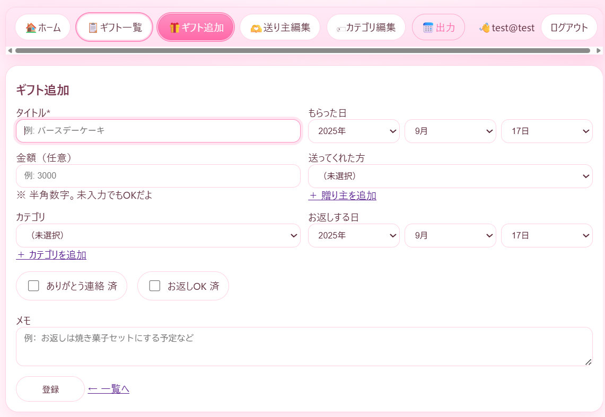

# GiftLog 🎁

「GiftLog」は、もらったプレゼントを記録・管理できる Flask アプリです。  
誰から、どんなギフトをもらったかを記録し、お返しやありがとう連絡を忘れないようにサポートします。

---

## 📌 機能一覧

- ユーザー登録・ログイン機能
- ギフトの追加・編集・一覧表示
- 検索・フィルタ
  - キーワード検索
  - 贈り主 / カテゴリ / 金額での絞り込み
  - 「返礼ToDoのみ」フィルタ
- ギフトの金額を入力し、合計・平均・カテゴリ別集計を表示
- お返しの期日をカレンダー（.ics）形式で出力
- 贈り主・カテゴリの追加・管理
- 可愛いピンクテーマの UI ✨

---

## 🛠️ 開発環境

- Python 3.10+
- Flask
- Flask-Login
- Flask-SQLAlchemy
- SQLite

---

## 🚀 起動方法

### 1. プロジェクトを用意
適当なフォルダにクローン or コピーしてください。

```text
giftlog/
├── app.py
├── templates/
├── static/
└── README.md
```

### 2. 仮想環境を作成

```bash
python -m venv .venv
```

### 3. 仮想環境を有効化

**Windows**

```bash
.venv\Scripts\activate
```

**macOS / Linux**

```bash
source .venv/bin/activate
```

### 4. 必要なライブラリをインストール

```bash
pip install flask flask-login flask-sqlalchemy
```

### 5. アプリを起動

```bash
python app.py
```

→ ブラウザで `http://127.0.0.1:5000/` を開けばOK！

---

## 📷 スクリーンショット

### ホーム画面


### ギフト一覧


### ギフト追加


### 贈り主の追加


## 📜 ライセンス
このプロジェクトは学習用に作成されたものです。  
個人利用や改変は自由に行えます。

## 開発概要

開発期間：約3週間（2025年9月上旬〜下旬）

使用技術
・バックエンド：Python, Flask, SQLAlchemy, Flask-Login
・フロントエンド：HTML, CSS
・その他：WTForms, Jinja2, selectinload
・開発環境：Python 3.x / VSCode / GitHub

工夫した点

・初回ログイン時にカテゴリ（食品・化粧品など）を自動登録
・ChatGPTを積極的に活用し、実装方針の検討、エラー解決、コードレビュー、UI改善アイデアの反映などを行った。AIを開発パートナーとして効率的に学習・開発を進めた